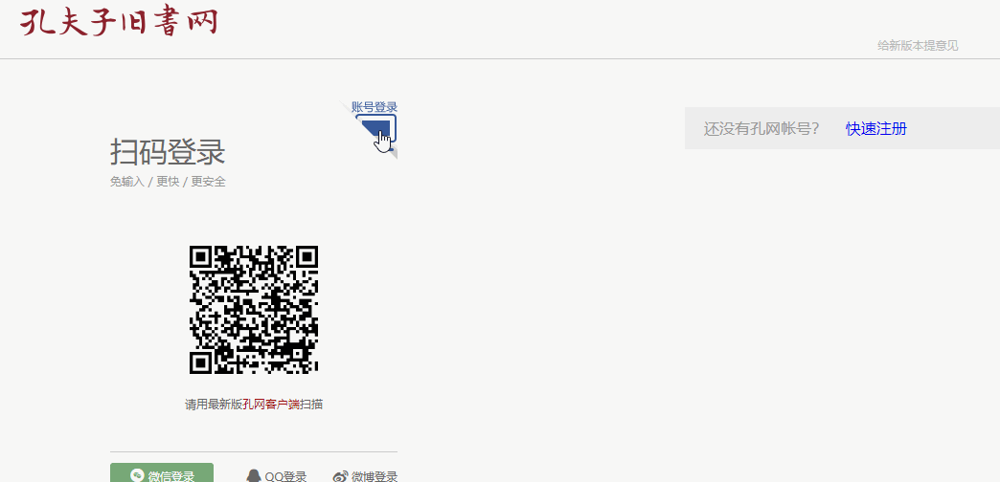
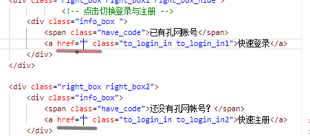

## 孔夫子旧书网项目文档说明

###     一.2019-10-09 

#### &ensp;1.进度报告

**&ensp;&ensp;1.完成进度报告** 				

​&ensp;&ensp;&ensp;&ensp;1.完成`登录与注册页面`的`html`和`css`构建以及不同登录方式之间的跳转

####&ensp; 		2.功能介绍        

​ **&ensp;&ensp;&ensp;1.不同登录页面切换**

####&ensp;3.遇见问题以及解决方案

  **&ensp;&ensp;&ensp;1.关于`<a href=""> `问题**
   *&ensp;&ensp;&ensp;&ensp;Question1:* 页面`a`标签跳转不成功
  
  `html`部分
  
  
  *Answer1:*当a标签href里面没有内容时无法进行click事件的触发

###     二.2019-10-10

#### &ensp;1.进度报告

**&ensp;&ensp;1.完成进度报告** 	

​&ensp;&ensp;&ensp;&ensp;1.完成`登录与注册页面`的构建以及不同登录方式之间的跳转以及数据库交互
​	
####&ensp; 		2.功能介绍

 **&ensp;&ensp;&ensp;1.不同登录页面切换**

 ### 三.2019-10-11~13

 #### &ensp;1.进度报告

  **1.完成进度报告**
  
  首页功能基本实现

  ### 四.2019-10-14~16

### 1.进度报告

** 1完成进度 **

列表功能基本实现
 
